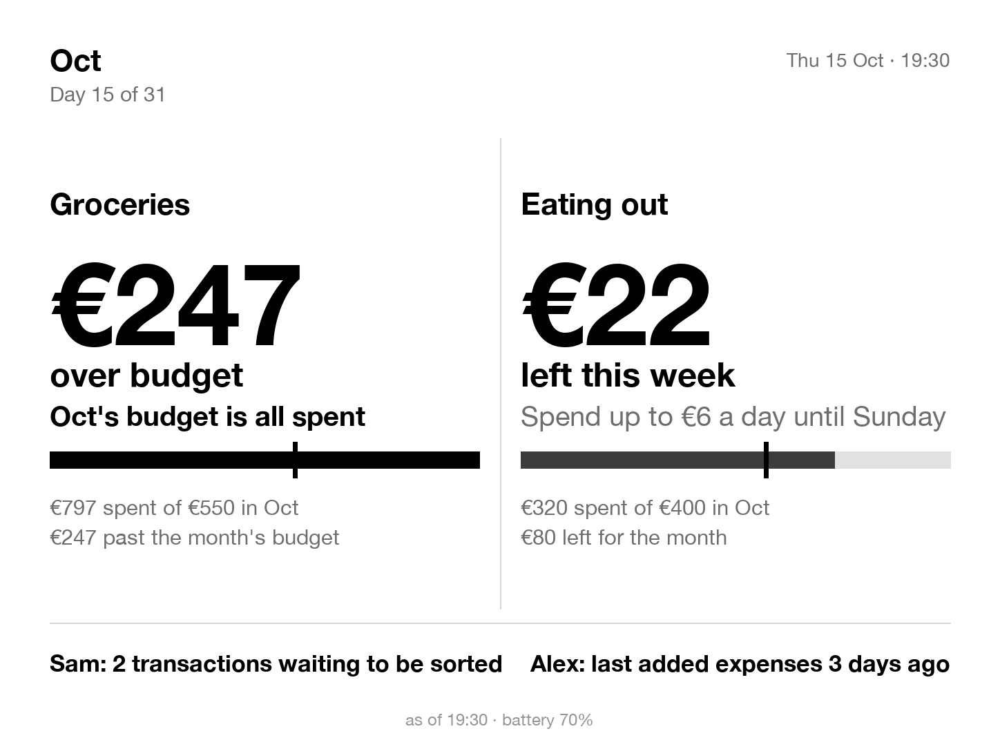
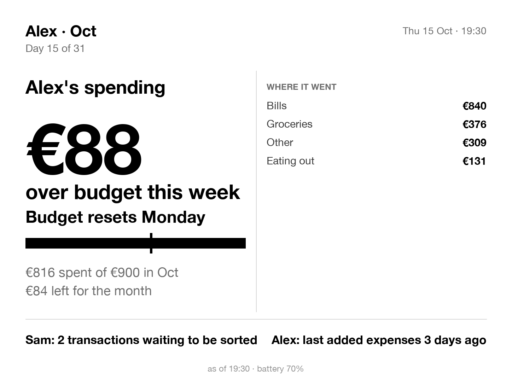
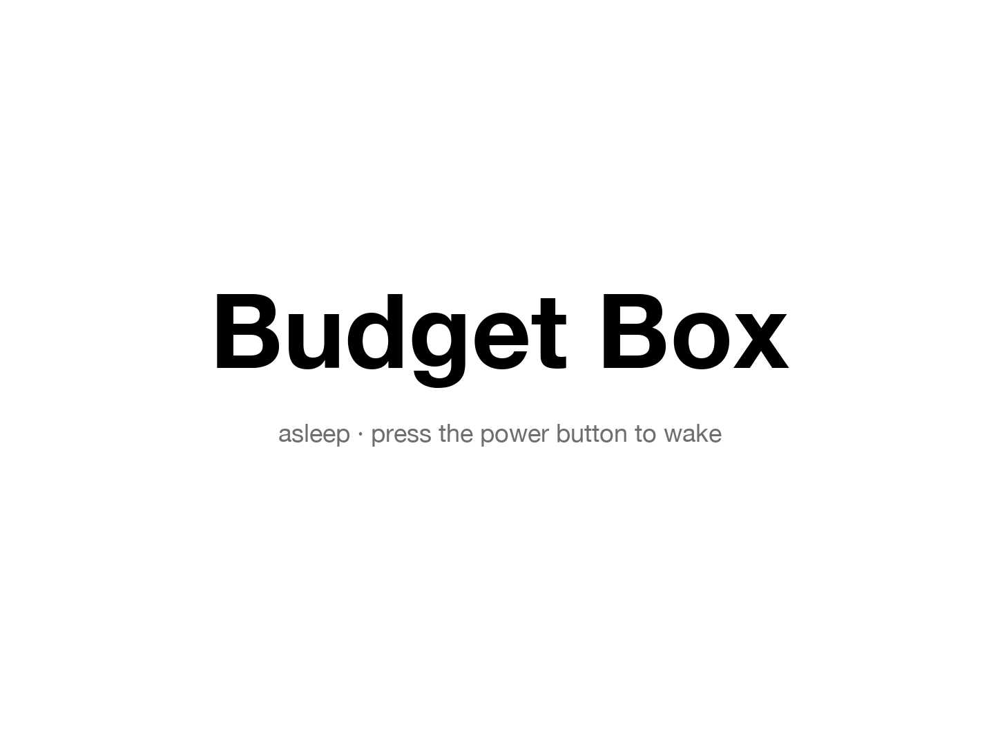

# Budget Box

**A jailbroken Kindle Paperwhite turned into an always-on household budget display.**

It sits in the kitchen and answers one question at a glance: *how much can we still spend this
week?* It redraws within a second of any change to the budget, cycles pages with a tap, and
sleeps behind its own screen when you press the power button.

<p align="center">
  
  
</p>

## How it works


- **The server draws, the device only displays.** budget-box turns each page of budget data into
  a 16-gray PNG sized for the panel. The Kindle fetches the PNG and paints it with `eips`. All the
  layout lives in Python, which is far easier to iterate on than anything on the device.
- **No polling on a timer.** Each image carries a version number. The device then holds a long
  poll that the server answers the moment the budget changes, so a new expense shows up in about
  a second. A 15-minute heartbeat keeps the clock and day current.
- **The data source is pluggable.** budget-box never sees a database. It speaks a small JSON
  contract (see [docs/data-contract.md](docs/data-contract.md)), and the author's household ledger
  is one implementation. `SOURCE=demo` serves the fixture pages, so the whole stack runs without one.

### The screen

Every block reads as plain sentences, weekly-first, because the week is what you can act on:

> **€22**
> **left this week**
> Spend up to €6 a day until Sunday
> ▬▬▬▬▬▬▬▬▬|▬▬▬▬
> €320 spent of €400 in Oct
> €80 left for the month

E-ink has no colour, so state is carried by weight and wording. An overspent week turns bold,
gets a solid black bar and says *"over budget this week · Budget resets Monday"*. The tick on the
bar is today's position within the week, so a bar that runs past the tick means spending ahead
of pace. The footer carries one nudge per person, such as transactions waiting to be sorted or
days since expenses were last added.

## On the device

The Kindle runs three small shell scripts from [device/](device/). They need a jailbroken Kindle
with SSH; the kernel and system are untouched apart from one boot job.

| Script | Job |
|---|---|
| `dash.sh` | Takes over the screen, fetches and paints pages, holds the long poll, backs off and shows "offline since" when the network drops. |
| `touch.sh` + `touch.awk` | Reads raw touchscreen events and turns any tap into "next page". |
| `button.sh` | Power button: draws the Budget Box screen and suspends. The next press wakes it. |

### Things the hardware taught me

- **Taps vanished, long swipes worked.** `hexdump` buffers 4 KB of output, and a tap is only a
  handful of 16-byte input events, so taps sat in the buffer until a swipe pushed them through.
  The fix reads the device one `dd` batch at a time and pipes each batch through a fresh `hexdump`.
- **The power button isn't an input event.** On the Paperwhite 4 it never appears under
  `/dev/input`, and Amazon's `powerd` ignores it once the stock UI is stopped. Each press does bump
  the power chip's interrupt counter in `/proc/interrupts`, so `button.sh` watches that. Plugging
  in the charger bumps the same counter; those presses are told apart by the charger's
  `online` flag in sysfs changing at the same moment.
- **Real suspend, with a safety net.** Sleep is `echo mem > /sys/power/state` after arming the
  SoC's RTC wake alarm. If the alarm or a charger plug is what woke it, it goes straight back to
  sleep, and only the button wakes the display. If waking by button ever failed, the alarm
  still brings it back.
- **Ghosting.** A partial e-ink update only moves the pixels that changed, so earlier pages bleed
  through, and `eips -c` turns out to be a partial update too. Page turns, waking and sleeping use
  a full-waveform update (`eips -f`); in-place number changes stay partial with a full refresh
  every few redraws.
- **Instant wake.** Wi-Fi takes 20–30 s to come back after suspend, so on wake the device shows the
  last page right away with an "Updating…" banner over its timestamp, until fresh data arrives.

<p align="center"></p>

## Run it

```bash
python -m venv .venv && .venv/bin/pip install -r requirements-dev.txt
.venv/bin/pytest                                    # wording, rendering, endpoints
cp .env.example .env                                # SOURCE=demo works out of the box
DEVICE_TOKEN=dev PYTHONPATH=server .venv/bin/uvicorn budget_box.app:app
curl -H "Authorization: Bearer dev" "localhost:8000/screen.png?rotate=0" -o page.png
```

**Deploy:** `deploy/push.sh user@host --infra` syncs the repo, builds the container and installs
a Caddy site block. It assumes a shared Caddy that apps join over an external `web` Docker
network; adapt [deploy/compose.yaml](deploy/compose.yaml) to your own proxy.

**The Kindle:** copy `device/` to `/mnt/us/dash/` over SSH, create `/mnt/us/dash/config` from
[device/config.example](device/config.example), then run `sh /mnt/us/dash/install.sh` on the device
and `start dash`. `sh install.sh remove` brings the stock Kindle back.

## Hardware

Kindle Paperwhite 4 (10th generation, 2018): 6", 1072×1448, 300 ppi, running firmware 5.16 with a
jailbreak and USBNetwork/SSH. Other Kindles should work with different panel sizes and input
device names; the power-button interrupt in `button.sh` is specific to the PW4's bd71827 power chip.

## License

MIT
